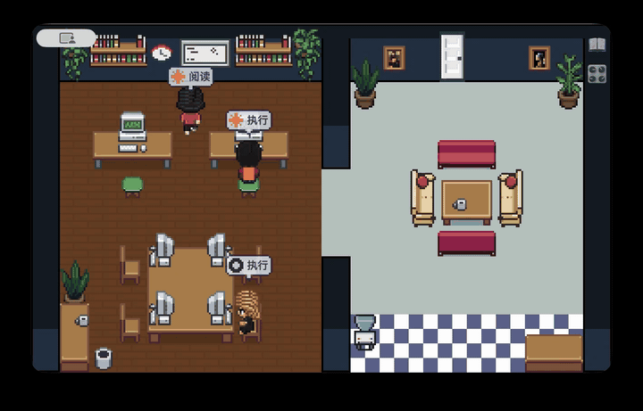
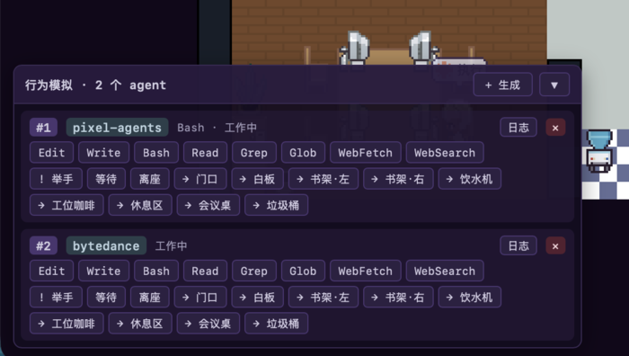
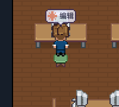
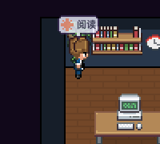
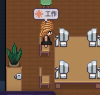
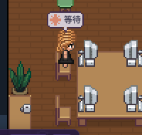
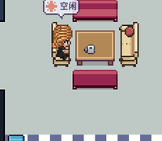

<p align="center">
  
</p>

<h1 align="center">Pixel Agents</h1>

<p align="center">
  <strong>See what your AI agents are up to — at a glance.</strong><br>
  <sub><a href="./README.md">English</a> · <a href="./README.zh-CN.md">简体中文</a></sub>
</p>

<p align="center">
  
</p>

Visualizes the CLI agents running on your machine (Claude Code, Codex CLI, Grok CLI — Trae next) as little pixel people in a desktop-sized office. Sitting at a desk = working. On the sofa = idle. Verb bubble overhead tells you what it's doing.

**Platform**: macOS / Linux only. Windows support would require porting the Unix-domain-socket IPC and `kill -0` liveness checks to named pipes + `OpenProcess`.

***

## What problem this solves

You've got 3 Claude Code windows chugging on tasks, one Codex refactoring something, and a Trae running in another project. Some are blocked on a `y` prompt, some have been stuck for 30 seconds, some have quietly finished. The usual fix: 3 terminals + a VS Code window + fast eyes.

This app consolidates all of them into **one screen**: each agent is a pixel character, with state conveyed through pose and position — **no dashboards, no numbers**. Peripheral vision is enough.

***

## Install

Head over to [Releases](../../releases) and grab the pre-built installer for your platform:

| Platform | File                 | Notes                                     |
| -------- | -------------------- | ----------------------------------------- |
| macOS    | `.dmg`               | Universal — runs on Apple Silicon + Intel |
| Linux    | `.AppImage` / `.deb` | x86_64                                    |

> The macOS build isn't notarized yet, so Gatekeeper will refuse to open it on first launch. Right-click the app → **Open** to bypass, or run `xattr -cr /Applications/pixel-agents.app` in Terminal.

Then launch once and every Claude / Codex / Grok session afterwards shows up as a pixel character.

***

## Usage

### Hook up Claude Code / Codex / Grok

The first time you launch the Tauri app it writes hook entries into whichever of these config files exist: `~/.claude/settings.json`, `~/.codex/hooks.json`, `~/.grok/user-settings.json`. Each entry is tagged with a `*-hook-forward.py` marker — your existing hooks are left alone. For Codex it additionally enables the `[features] codex_hooks = true` flag in `~/.codex/config.toml` if missing, since hooks are gated on it. From then on every `claude` / `codex` / `grok` session shows up as a pixel character — no manual config required.

### Multiple sessions in the same repo

The dev panel and in-world tags identify each agent by `basename(cwd)`. When two agents share the same folder (e.g. two Claude Code sessions on `pixel-agents`), the label auto-expands to `pixel-agents·a7b3` using a 4-char slice of the session UUID (past the UUIDv7 timestamp prefix, so siblings started in the same millisecond still disambiguate).

<p align="center">
  
</p>

### Language

Top menu bar → **Language** → **中文 / English**. The choice persists via `localStorage`; the menu, window title, and in-app copy all follow.

### Other agents (Trae, custom CLIs)

Look at `src-tauri/src/adapter/` for the shape of an adapter — normalize the provider's event stream (log tail, SDK emit, pty wrap — your call) into `{ session_id, kind, tool?, cwd? }` with a `source` tag and pipe it to the UDS at `~/.pixel-agents/bus.sock`.

### Behavior cheat sheet

|                                                                                  | What you see                          | What it means                                               |
| -------------------------------------------------------------------------------- | ------------------------------------- | ----------------------------------------------------------- |
|     | Sitting, typing at desk               | Running Edit / Write                                        |
|     | Same pose, 执行 bubble                 | Running Bash                                                |
|     | Walking to bookshelf, flipping pages  | Running Read / Grep / Glob / WebFetch                       |
|  | Verb bubble "asking"                  | Waiting on your permission (Notification)                   |
|     | Verb bubble "working"                 | Active but no tool call yet (Codex thinking window)         |
|     | Verb bubble "waiting"                 | Stop, but hasn't idled out yet (≤ 60s)                      |
|      | Sitting on the sofa                   | Stop + idle > 60s                                           |
| —                                                                                 | Fading in / out at the door           | SessionStart / SessionEnd (matrix-rain pixel burst)         |
| —                                                                                 | Two agents pause + one re-routes      | Inter-character collision — A\* only plans around furniture |

Top-right icon stack: 📖 opens the full behavior legend, 🎛 opens the dev / mock-event panel. The dev panel lets you fire events by hand — you can play with it without any real CLI session.

***

## Architecture

```
Claude / Codex / Grok hook (stdin JSON)
        ↓
  scripts/{claude,codex,grok}-hook-forward.py   # Python shim, stamps `source`
        ↓
  ~/.pixel-agents/bus.sock                      # Unix Domain Socket
        ↓
  Tauri Rust host (src-tauri/)
     adapter/mod.rs dispatches on source → adapter/{claude,codex,grok}.rs
        ↓   app.emit("agent-event")
  React webview (src/)
        ↓
  OfficeState singleton (imperative mutation)
        ↓
  Canvas 2D rAF loop: update(dt) → render(ctx)
```

**Stack**: Tauri 2.x + Vite + React 19 + TypeScript + Canvas 2D. **Not Pixi.js.**

Deeper dive for contributors: [`CLAUDE.md`](./CLAUDE.md) (a 5-minute getting-started).

***

## Layout

```
src/                 React + TypeScript frontend
  office/            Game core (engine / layout / sprites / editor)
    engine/          officeState / character FSM / renderer / gameLoop
    layout/          furnitureCatalog / layoutSerializer / tileMap (A*)
    sprites/         Character sprites + colorize cache
  components/        UI overlay (LangSwitch / Legend / MockEventPanel)
  hooks/             Event bridges (Tauri / VS Code ext / mock)
  i18n/              Chinese + English dictionary
  __tests__/         Vitest unit tests

src-tauri/           Rust desktop shell (unix-only)
  src/ipc.rs         UDS listener; single-instance safe
  src/adapter/       Per-CLI hook normalization (claude / codex / grok)
  src/installer.rs   Auto-writes each CLI's settings on launch
  src/reaper.rs      Synthesizes session_end when a CLI dies uncleanly

public/assets/       Pixel art (furniture / floors / walls)

scripts/
  pixel-asset/                  nano banana → pixel-art workflow
                                (see scripts/pixel-asset/README.md)
  {claude,codex,grok}-hook-forward.py   Python hook shims
```

***

## Adding furniture assets

Full walkthrough: [`scripts/pixel-asset/README.md`](./scripts/pixel-asset/README.md). TL;DR, 3 steps:

1. Generate the reference image with nano banana → save to `scripts/pixel-asset/input/<asset>.jpeg`
2. Copy `process_template.py` → `process_<asset>.py`, tweak params, run it
3. Register the new entry in `src/office/layout/furnitureCatalog.ts`

The script does a 4-pass downsample (background removal → mode-filter dominant color → dark-mask outline → contour tightening). The output drops straight into the game.

***

## Development

Only needed if you want to hack on the app. Regular users should grab a [Release](../../releases) instead.

**Requires Node ≥ 20.19** (Vite 7) and a recent Rust toolchain. With nvm:

```bash
nvm use 22
git clone <this-repo>
cd pixel-agents
npm install
```

```bash
# Option A: pure frontend (browser, with a mock event loop — no real CLI)
npm run dev              # open http://localhost:1420/

# Option B: full desktop app (Tauri window + real hook IPC)
npm run tauri dev

# Tests
npm test                 # Vitest
(cd src-tauri && cargo test)   # Rust unit tests

# Package a local bundle
npm run tauri build
# artifacts → src-tauri/target/release/bundle/
```

A tag push (`git tag v0.2.0 && git push --tags`) triggers `.github/workflows/release.yml`, which runs `tauri build` on macOS / Windows / Linux in parallel and attaches the artifacts to a GitHub Release — that's the path users install from.

`test-hook-sandbox/` is an end-to-end hook sandbox that never touches your real `~/.claude/settings.json`.

***

## License & contributing

Still prototype-stage — the API, layout, and event schema may change. PRs for new agent adapters or furniture are welcome.

Third-party attributions: [`THIRD_PARTY_NOTICES.md`](./THIRD_PARTY_NOTICES.md).
